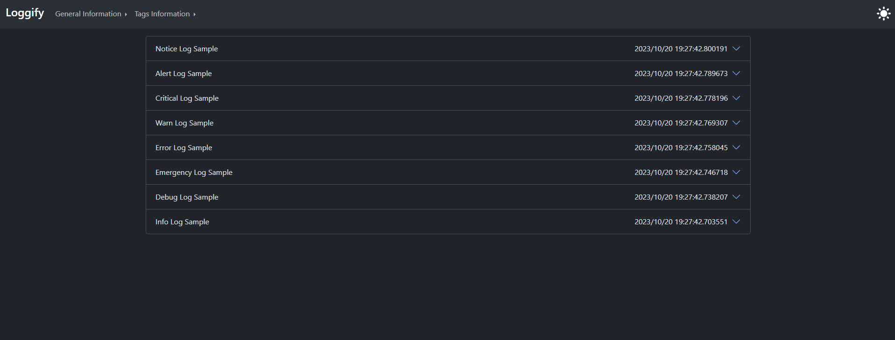
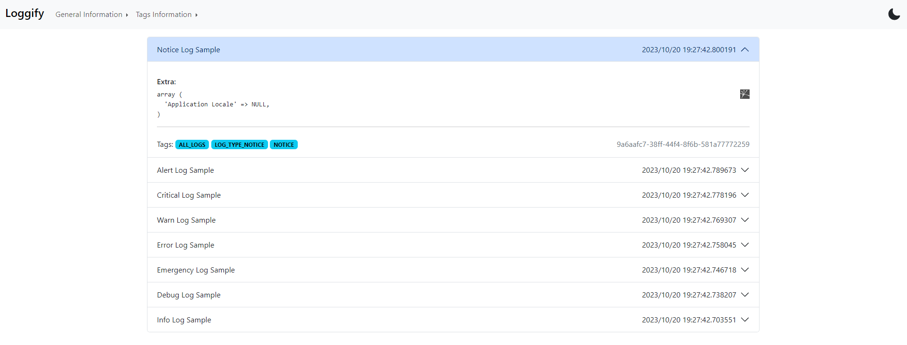
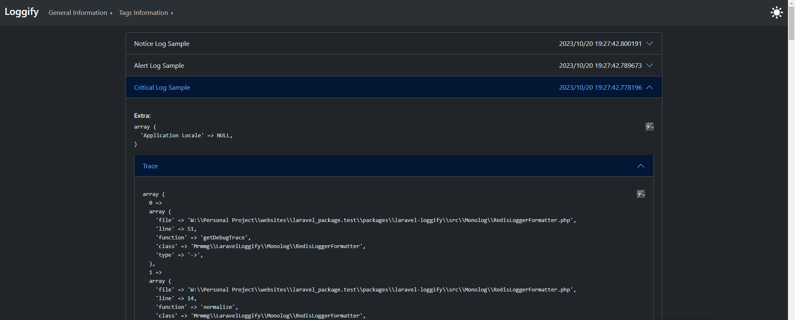
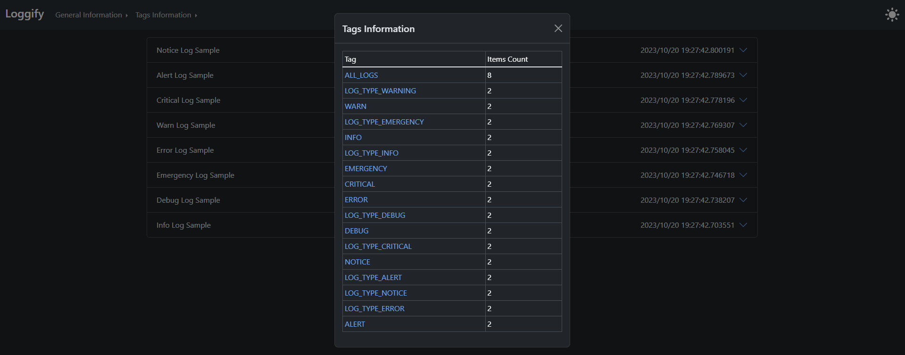

# Loggify
Managing Laravel Logs with Tags and Enhanced Options.
### The meaning
Based on ChatGPT response `"Loggify" is not a standard word in the English language, and it doesn't have an established definition. you can define it as something like: To streamline or enhance the process of creating and managing logs or records, especially in a digital or data-driven context. This may involve automating log generation, improving log organization, or making logs more user-friendly for analysis and monitoring purposes.`

### What do this package?
This package assists Laravel developers in storing application logs in a Redis database (currently supported) and provides a convenient system for categorizing these logs using tags. This allows developers to easily navigate through logs based on their assigned tags.

## Getting Started

### Before Install
Since this package utilizes Redis to store and manage logs, it's important to configure Laravel to work seamlessly with Redis. Additionally, make sure to install the necessary Redis requirements for Laravel, such as `predis`.
### Installation

```shell
composer require mrmmg/laravel_loggify 
```

Next, you'll need to publish the Loggify assets and configuration by running:

```shell
php artisan loggify:install
```
This command create `loggify.php` configuration file in `config` directory and create loggify assets in `public/verndor/loggify`.

## Configuration
The `loggify.php` configuration file is self-documented with comment blocks. Nevertheless, I will provide an explanation for clarity:

#### Database and Redis ```database.redis```
Similar to Laravel `config/database.php`, this section describes the Redis connection settings, which you can customize to fit your requirements. By default, all logs are stored in Redis database 10.

```php
'database' => [
        'redis' => [
            'client' => env('REDIS_CLIENT', 'phpredis'),

            'url' => env('REDIS_URL'),
            'host' => env('REDIS_HOST', '127.0.0.1'),
            'username' => env('REDIS_USERNAME'),
            'password' => env('REDIS_PASSWORD'),
            'port' => env('REDIS_PORT', '6379'),
            'database' => '10',
        ]
    ],
```

### Logging ```logging```
This section is used to define Loggify log channel options. There's generally no need to make changes in this section.

### Log Expiration ```log_expire_seconds```
Redis is an in-memory database, and it's crucial to manage memory usage for logs. Therefore, you can specify how many seconds Redis should retain log items. By default, log items are retained for 1 day, which equals 86,400 seconds.

### Log Tag Limits ```max_tag_items```
**Not Implemented Yet**

This option will control how many log items each log tag can hold, although it is not yet implemented.

### Guards ```guard```
**Not Implemented Yet**

These options control access to the Loggify web panel using Laravel middlewares.

## Usage
By using the Laravel Log Facade, you can integrate Loggify.

### Examples
```php
use Illuminate\Support\Facades\Log;

Log::channel('loggify')->info("Info Log Sample");
```

Where are the enhanced options?

The second parameter of Laravel log methods, referred to as context, is leveraged by Loggify to manage both log 'tags' and 'extra' log data. Let's continue with the previous example:
```php
use Illuminate\Support\Facades\Log;

Log::channel('loggify')
            ->info("Info Log Sample", [
                'tags' => ['MY_CUSTOM_TAG']
            ]);
```

Great! You've successfully created a log tagged with `MY_CUSTOM_TAG`. You can use as many tags as you need; there are no set limits.

```php
use Illuminate\Support\Facades\Log;

$user_id = \Illuminate\Support\Facades\Auth::id();
$user_type = ...;

Log::channel('loggify')
            ->info("User Logged-In", [
                'tags' => [
                    "USER_$user_id",
                    "API_VERSION_1",
                    "USER_TYPE_$user_type"
                ]
            ]);
```

To add extra data to the log context:

```php
use Illuminate\Support\Facades\Log;

Log::channel('loggify')
            ->info("Info Log Sample", [
                'tags' => ['INFO'],
                'extra' => ['Application Locale' => config('app.locale')]
            ]);
```

Other elements within the context are stored under the context key in the log stack, following the default Laravel behavior.
```php
use Illuminate\Support\Facades\Log;

Log::channel('loggify')
            ->info("Info Log Sample", [
                'tags' => ['INFO'],
                'extra' => ['Application Locale' => config('app.locale')],
                'request_data' => $request->all()
            ]);
```

In the above example, the request_data is stored in the context, while the tags and extra are stored in other parts of the log.
### Trace System
Loggify can assist you in debugging and identifying issues within your application by automatically storing the PHP debug backtrace feature. You don't need to take any additional steps; Loggify stores the backtrace for logs of the following types:
- debug
- alert
- critical
- emergency
- error
- warning

#### Examples
```php
use Illuminate\Support\Facades\Log;

Log::channel('loggify')
            ->debug(...)
            
Log::channel('loggify')
            ->alert(...)

Log::channel('loggify')
            ->critical(...)

Log::channel('loggify')
            ->emergency(...)

Log::channel('loggify')
            ->error(...)

Log::channel('loggify')
            ->warning(...)
```

All the log examples mentioned above store the debug backtrace in the database, and you can view them in the Loggify web panel.

### The Default Tags
By default, Loggify add two tags to your tags, `ALL_LOGS` and `LOG_TYPE_{laravel_log_type}`. for example:

```php
use Illuminate\Support\Facades\Log;

Log::channel('loggify')
            ->info("Info Log Sample", [
                'tags' => ['INFO'],
                'extra' => ['Application Locale' => config('app.locale')],
                'request_data' => $request->all()
            ]);
```

The log mentioned above can be located in the web panel by filtering with the `ALL_LOGS`, `LOG_TYPE_INFO`, and `INFO` tags.

### Web Panel
To view the stored logs, open a web browser and navigate to the `yourappurl.example/loggify` route.

By passing the log tag after that url the Loggify shows the tag logs, for example `yourappurl.example/loggify/ALERT` show all logs that tagged with `ALERT` tag.

#### Screenshots

##### Dark/Light Theme



##### Log with Trace


##### Tags Information


## I need your help 🤝
We welcome contributions from the community to help enhance this package further. If you'd like to collaborate and make it even better, please feel free to get involved.

## Todo
- [x] Fix Trace System Issues
- [x] Implement web panel authorization
- [ ] Implement tag items limit
- [ ] Implement tests
- [ ] Make Better document and GitHub pages
- [ ] Re-Design WebPanel
